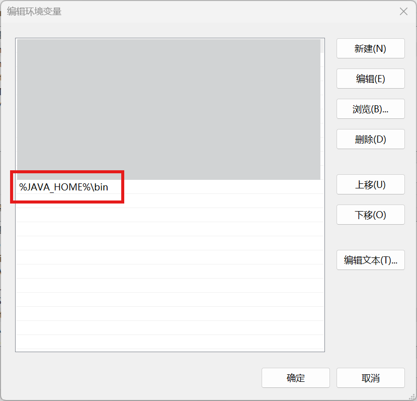

# Web Map Demo (GeoServer+FastAPI+Leaflet)

## 0 说明

项目说明：

- 内容：完成一个Web端的地图服务小案例。
- 目标：
  - 了解地图服务；
  - 了解Web应用的概念、前后端和网页服务；
  - 简单学习前后端的技术框架并进行编程实现。
- 技术路线：[GeoServer](https://geoserver.org/) + [FastAPI](https://fastapi.tiangolo.com/) + [Leaflet](https://leafletjs.com/)

代码库：[https://github.com/Bill-Cai/web-map-demo](https://github.com/Bill-Cai/web-map-demo)

目录：

- [Web Map Demo (GeoServer+FastAPI+Leaflet)](#web-map-demo-geoserverfastapileaflet)
  - [0 说明](#0-说明)
  - [1 背景介绍](#1-背景介绍)
  - [2 相关技术](#2-相关技术)
    - [2.1 GeoServer](#21-geoserver)
    - [2.2 B/S Architecture \& Web Application](#22-bs-architecture--web-application)
    - [2.3 FastAPI](#23-fastapi)
    - [2.4 Leaflet](#24-leaflet)
  - [3 案例实现](#3-案例实现)
    - [3.1 GeoServer 使用](#31-geoserver-使用)
      - [3.1.1 Installation](#311-installation)
        - [Step 1. 安装 Java 17](#step-1-安装-java-17)
        - [Step 2. 运行 GeoServer](#step-2-运行-geoserver)
      - [3.1.2 发布 shapefile](#312-发布-shapefile)
        - [Step 1. Data preparation](#step-1-data-preparation)
        - [Step 2. Creating a new workspace](#step-2-creating-a-new-workspace)
        - [Step 3. Create a store](#step-3-create-a-store)
        - [Step 3. Creating a layer](#step-3-creating-a-layer)
    - [3.2 FastAPI 后端](#32-fastapi-后端)
      - [3.2.1 Quick Start](#321-quick-start)
      - [3.2.2 后端代码](#322-后端代码)
    - [3.3 Leaflet 前端](#33-leaflet-前端)
  - [4 拓展](#4-拓展)

## 1 背景介绍

随着地理信息技术的快速发展，Web地图服务已经成为各种应用的核心组成部分。Web地图通过将地图数据与Web前端技术结合，向用户展示动态、交互式的地理信息。本项目将使用GeoServer、FastAPI和Leaflet技术构建一个Web地图服务，提供地理数据的可视化展示。通过这一过程，展示新手该如何搭建一个Web端地图应用，并对前后端技术的基本框架有一个初步的认识。

该案例的目标是让用户熟悉Web地图服务的基本工作原理，掌握如何通过**GeoServer发布地图服务**，通过**后端提供地图数据**，通过**前端地图框架展示数据**，并实现简单的交互功能。

## 2 相关技术

### 2.1 GeoServer

[GeoServer](https://geoserver.org/) 是一个开源的地图服务器软件，用于发布、共享、编辑和处理地理空间数据。GeoServer支持多种标准数据格式，如Shapefile、PostGIS数据库、GeoTIFF等，并通过标准的Web服务协议（如WMS、WFS、WCS）向客户端提供地图服务。在本案例中，GeoServer将用于发布地图数据并通过Web接口提供给前端进行显示。

### 2.2 B/S Architecture & Web Application

有关 B/S 和 C/S 架构的定义、概念、应用常见等，可以自行百度，对网页应用前后端有个基本认识即可。

### 2.3 FastAPI

[FastAPI](https://fastapi.tiangolo.com/) 是一个用于构建现代Web APIs的高性能框架，基于Python语言构建，能够快速开发高效且易于使用的API。在本案例中，FastAPI将作为后端服务框架，用于提供GeoServer的地图数据接口，并将其传递到前端进行展示。

### 2.4 Leaflet

[Leaflet](https://leafletjs.com/) 是一个轻量级、开源的JavaScript库，用于构建交互式地图应用。它支持从多个来源加载地图数据（包括GeoServer、OpenStreetMap、Google Maps等），并能够在地图上进行标记、绘制图形等操作。在本案例中，Leaflet将用于构建前端地图应用，向用户展示GeoServer提供的地图数据，并提供交互式的地理信息浏览体验。

## 3 案例实现

本案例：

1. 通过 GeoServer 发布一个 Shapefile 文件为地图服务；
2. 通过 Python 的 FastAPI 库进行后端搭建，对地图服务的请求进行转发，并提供其他数据接口；
3. 通过前端三件套和 Leaflet 组件完成前端交互地图网页的制作。

### 3.1 GeoServer 使用

#### 3.1.1 Installation

参考 [官方文档](https://docs.geoserver.org/latest/en/user/installation/index.html) 对 GeoServer 进行安装，这里推荐通过 [二进制包](https://docs.geoserver.org/latest/en/user/installation/win_binary.html) 的方式进行安装。

> 只需要解压 binary 包就可以直接使用了。

##### Step 1. 安装 Java 17

GeoServer 最新版本要求系统预装 Java 11 或 17 。

在 [Oracle Java 官网](https://www.oracle.com/java/technologies/downloads/#java17-windows) 上下载 Java 17 压缩包：

<div align="center">

</div>

解压后，将 jdk 路径配置到环境变量 `%JAVA_HOME%` 。

<div align="center">

</div>

> 注意：`%JAVA_HOME%` 配的不是 `bin` 的路径，而是整个 JDK 的路径。

<div align="center">

</div>

之后再在 `PATH` 变量中添加 `bin` 路径。

<div align="center">

</div>

检验环境配置是否成功：

<div align="center">

</div>

##### Step 2. 运行 GeoServer

从 [GeoServer 官网](https://geoserver.org/release/stable/) 下载 [Platform Independent Binary](https://sourceforge.net/projects/geoserver/files/GeoServer/2.26.0/geoserver-2.26.0-bin.zip) 压缩包。

<div align="center">

</div>

解压 GeoServer 的二进制包如下：

<div align="center">

</div>

直接双击 `geoserver-2.26.0-bin\bin` 文件夹下的 `startup.bat` 运行启动脚本并保持终端一直运行。

> GeoServer 服务运行过程中，**终端需要一直保持运行**；关闭服务，则可以双击运行 `geoserver-2.26.0-bin\bin` 文件夹下的 `shutdown.bat` 脚本，或者直接关闭 `startup.bat` 打开的终端即可。

浏览器访问本地：`http://localhost:8080/geoserver`

<div align="center">

</div>

进入该页面则成功。

用户的默认登陆账密为：

- username: `admin`
- password: `geoserver`

登录后进入控制页面：

<div align="center">

</div>

#### 3.1.2 发布 shapefile

参考 [Publishing a shapefile — GeoServer 2.27.x User Manual](https://docs.geoserver.org/latest/en/user/gettingstarted/shapefile-quickstart/index.html) 文档，发布一个 shapefile 文件，作为地图服务。

shp 文件选取了美国的 51 个一级行政区（来源：[Natural Earth » Blog Archive » Admin 1 – States, provinces - Free vector and raster map data at 1:10m, 1:50m, and 1:110m scales » ne_50m_admin_1_states_provinces.zip](https://www.naturalearthdata.com/http//www.naturalearthdata.com/download/50m/cultural/ne_50m_admin_1_states_provinces.zip)，通过QGIS选取了美国部分），数据在 [US_states](./Part1_GeoServer/US_states/) 文件夹下。

##### Step 1. Data preparation

将 [US_states](./Part1_GeoServer/US_states/) 文件夹拷贝到 `geoserver/data_dir/data` 下：

<div align="center">

</div>

##### Step 2. Creating a new workspace

通过 **Data > Workspaces > Add new workspace** 新建一个工作空间，用于将相似图层组合收纳在一起：

<div align="center">

</div>

填入工作空间的名称和 URI：

- Name 填入工作空间名称：`us_states`
- Namespace URI 填入 URL 地址：`http://localhost/us_states`

<div align="center">

</div>

> **Note** A workspace name is an identifier describing your project. It must not exceed ten characters or contain spaces. A Namespace URI (Uniform Resource Identifier) can usually be a URL associated with your project with an added trailing identifier indicating the workspace. The Namespace URI filed does not need to resolve to an actual valid web address.

##### Step 3. Create a store

通过 **Data > Stores > Add new store** 新建一个

<div align="center">

</div>

设置相关信息并浏览到对应的 shp 文件路径：

<div align="center">

</div>

##### Step 3. Creating a layer

完成上一步后会自动跳转到下面的 New Layer 页面：

<div align="center">

</div>

如果没有，也可以通过 **Data > Layers > Add a new Layer > Add layer from ...** 找到。

点击 **Publish** 后即可进入该 Layer 的编辑界面：

<div align="center">

</div>

可以对其中的 **Title** 和 **Abstract** 进行编辑，并自动计算 **Bounding Boxes** 。

保存后即已发布：

<div align="center">

</div>

可以在 Layer Preview 中预览：

<div align="center">

</div>

预览结果：

<div align="center">

</div>

### 3.2 FastAPI 后端

参考 [教程 - 用户指南 - FastAPI](https://fastapi.tiangolo.com/zh/tutorial/) 构建基于 Python 的后端应用，完成：

- 针对地图服务的请求转发：这里地图服务就以上面的 shp 为例。
- 针对数据查询请求的响应：数据以 [US_cities_2022.csv](./Part2_Backend/US_cities_2022.csv) 为例（数据来源：[US cities 2022 | Kaggle](https://www.kaggle.com/datasets/frankschindler1/us-cities-2022-population-coordinates-etc)），将 csv 文件数据加载到后端内存中，完成数据查询 API 以模拟数据库查询操作。

#### 3.2.1 Quick Start

在 Python 环境中 进行 FastAPI 库的安装：

```bash
pip install fastapi    # FastAPI库
pip install uvicorn    # uvicorn服务器
```

新建一个 [`main.py`](./Part2_Backend/main.py) 文件，写入最简单的测试案例：

```python
from fastapi import FastAPI

app = FastAPI()

@app.get("/")
async def root():
    return {"message": "Hello World"}
```

通过命令行运行：

```bash
uvicorn main:app --reload
```

其中：

- `uvicorn`：服务器命令；
- `main:app`：在 `main.py` 文件中通过 `app = FastAPI()` 创建的对象；
- `--reload`：使服务器在更新代码后重新启动（仅在开发时使用该选项）。

如果希望直接运行 Python 文件来启动后端服务，则可以通过主函数调用 `uvicorn` 运行并设置相关参数：

```python
import uvicorn
from fastapi import FastAPI

app = FastAPI()

@app.get("/")
async def root():
    return {"message": "Hello World"}

if __name__ == "__main__":
    uvicorn.run("main:app", host="localhost", port=8000, reload=True)
```

运行后，服务启动：

<div align="center">

</div>

访问 [http://localhost:8000/](http://localhost:8000/) 得到：

<div align="center">

</div>

在终端中键入 **CTRL+C** 停止运行。

#### 3.2.2 后端代码

案例的后端代码，见：[backend.py](./Part2_Backend/backend.py)

### 3.3 Leaflet 前端

Leaflet 入门，见：[Meteorite Landings Map: A Tiny Web Map Demo for Visualization - 少数派](https://sspai.com/post/93816)

案例的前端代码，见：[Part3_Frontend](./Part3_Frontend)

## 4 拓展

自行探索

1. GeoServer 更多的功能，例如自定义样式、瓦片地图发布等。
2. Web 后端开发，可以尝试写数据库的 CURD，参考：[Building a CRUD Application with FastAPI and PostgreSQL | by Shubham Adhikari | Medium](https://medium.com/@adhikarishubham419/building-a-crud-application-with-fastapi-and-postgresql-db9fbc1ed19e)
3. 优化前端 UI 设计。
4. 添加地图交互功能。
